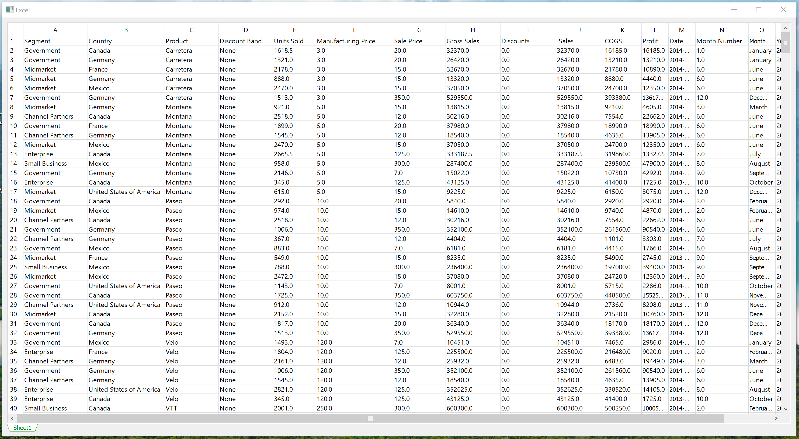

**Excel Workbook View**
==============================



The ExcelWorkView is a PyQt4-based widget that enables the browsing of Excel (*.xls or *.xlsx) files. It provides a simple and familiar Excel-like interface for browsing one or more worksheets in an Excel file.

Key features include:
* Vertical and horizontal (sequential uppercase) headers that mimick the Excel interface
* Tab widgets at the bottom for selecting sheet tables
* Progress bar for showing status when loading an Excel file
* Based on a modular API design
 

### Pre-requisite

The widget is dependent on the [xlrd](https://xlrd.readthedocs.io/en/latest/index.html) library for reading Excel data hence it must be installed prior. Installation instruction are available [here](https://xlrd.readthedocs.io/en/latest/installation.html).

### Installation

1. Clone the repository
2. Copy the file *excel_widget.py* and paste it into your project directory

### Usage

```buildoutcfg
from table_widget import ExcelWorkbookView

ewv = ExcelWorkbookView()
ewv.load_workbook('D:/test_data/sample_data.xlsx')

# Specify date display format as dd-mm-yyyy. Uses Python's strftime() format
ewv = ExcelWorkbookView(date_format='%d-%m-%Y')
ewv.load_workbook('D:/test_data/sample_data.xlsx')

```

Every worksheet view has a reference to a `WorksheetInfo` object which contains the following attributes:
* Zero-based tab index of the specific worksheet view in the workbook view
* Reference to the `ExcelSheetView` widget which is displayed on each tab. This widget inherits from a `QTableWidget`
* Name of the specific worksheet, with the default being **Sheet 1** in Excel
* Reference to xlrd's `Sheet` object, which contains the actual worksheet data. The data can be accessed by specifying the row index and column index i.e. `sheet.cell_value(row_index, column_index`). More information on xlrd's `Sheet` class is available [here](https://xlrd.readthedocs.io/en/latest/api.html#xlrd-sheet).

```buildoutcfg
# Get current (tab's) WorksheetInfo object
ws_info = ewv.current_worksheet_info()

# Get WorksheetInfo object for the first tab
ws_info = ewv.worksheet_info(0)

# Print index
>>> ws_info.idx

# Sheet widget
sheet_widget = ws_info.ws_widget

# Print sheet name
>>> ws_info.name

# Get Sheet object
sheet = ws_info.ws
# Print the value of the first cell i.e. index (0,0)
>>> sheet.cell_value(0, 0)
```

### License

You can redistribute it and/or modify it under the terms of the GNU General Public License version 3 (GPL v3) as published by the Free Software Foundation. The full GNU General Public License is available in LICENSE.txt or [here](https://www.gnu.org/licenses/gpl-3.0.en.html).
    

